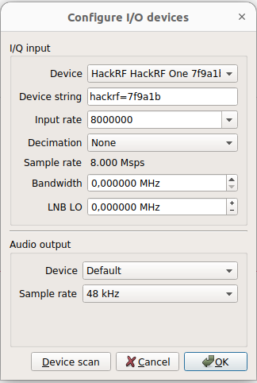
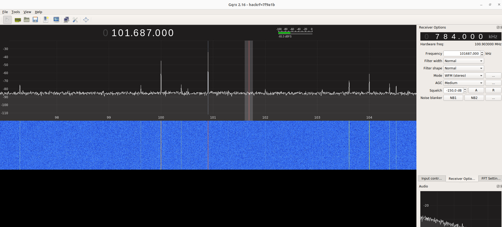
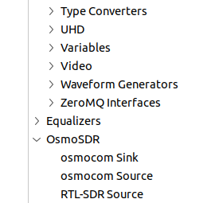

# Projeto SDR <!-- omit from toc -->

*Sumário*
- [Introdução](#introdução)
- [Pré-requisitos](#pré-requisitos)
- [Verificando funcionamento da placa](#verificando-funcionamento-da-placa)
- [Osmocom](#osmocom)
- [Abrindo o projeto](#abrindo-o-projeto)


## Introdução
Neste repositório se encontra o projeto realizado com o [HackRF](https://greatscottgadgets.com/hackrf/) para aplicar na pratica os conceitos estudados durante a disciplina de COM1. Para facilitar a programação do sistema foi utilizado o [GNU Radio](https://www.gnuradio.org/) e os blocos [osmocom](https://osmocom.org/projects/gr-osmosdr/wiki/GrOsmoSDR).

Para verificar o comportamento esperado da placa foi utilizado o [GQRX](https://gqrx.dk/) para reproduzir ás radios FM locais.

## Pré-requisitos
-   Ubuntu 22.04 (Versão da qual foi reproduzido os testes)
-   Python 3.10
-   libhackrf-dev
-   libsndfile-dev
-   CMake
-   GNU Radio

No terminal execute:
```bash
sudo apt update
sudo apt install python3.10 cmake libhackrf-dev libsndfile-dev
```


## Verificando funcionamento da placa
Faça o download, instale o [GQRX](https://gqrx.dk/download) e conecte a placa ao computador.

Ao executar o GQRX irá aparecer uma janela para configurar o dispositivo conforme a imagem a baixo:



Se a conexão ocorrer com sucesso deve aparecer uma tela conforme abaixo, clique no botão de `play` para iniciar captação do espectro RF:



## Osmocom

Utilizamos os blocos da [osmocom](https://osmocom.org/projects/gr-osmosdr/wiki/GrOsmoSDR) para facilitar a configuração da recepção do sinal. Para instalar os blocos garanta que os pré-requisitos foram instalados e faça:

-   Clone o repositório:
```bash
    git clone https://github.com/osmocom/gr-osmosdr.git
    cd gr-osmosdr
```

-   Construa e compile o projeto utilizando o CMake:
```bash
    cmake -S . -B build
    cmake --build build
```
-   Para instalar os blocos no GNU Radio faça:
```bash
    cd build
    sudo make install
    sudo ldconfig
```
 Com a instalação concluída deve aparecer na aba de blocos do GNU Radio a opção OsmoSDR.

 

 ## Abrindo o projeto

 -  Clone o repositório:
 ```bash
    git clone https://github.com/mikeicd/projeto-sdr.git
```
-   Com o GNU Radio aberto, na barra de menus clique em `File/Open` e selecione o projeto `testePlaca.grc` disponibilizado neste repositório.

